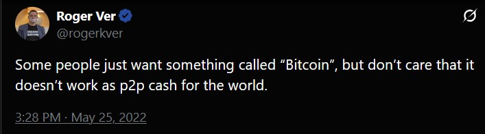
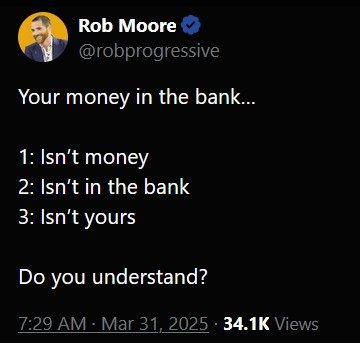
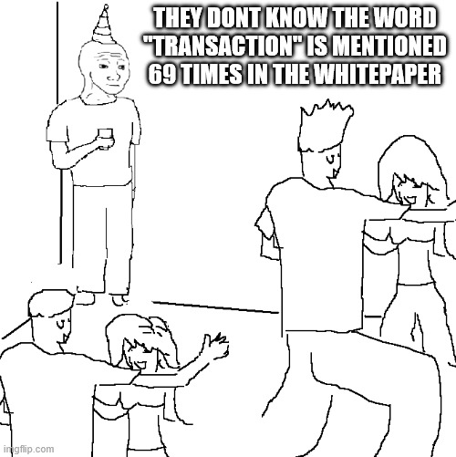
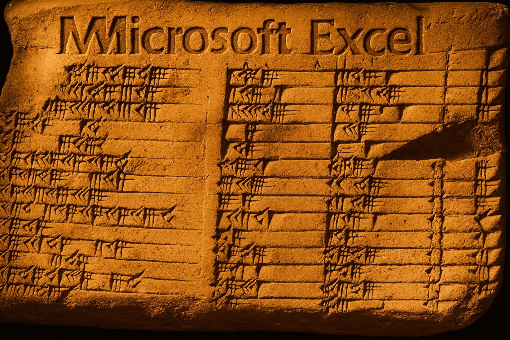

# The Philosophy of the Whitepaper 

Note:
Welcome.  
Not a technical look, but a look at some of the language used, our assumptions about that language. 
we all have ideas about what words mean.  
We’ll examine how a few ordinary words are redefined so new behaviour becomes possible. 
Meanings of words I want to explore. 
As I read and re-read the WP, I kept finding more. 
This is my first attempt. 

---

> "I had to write all the code before I could convince myself that I could solve every problem, then I wrote the paper."

<small>Satoshi Nakamoto, 09/11/2008</small>

Code before Words **=** Language Engineering

Notes:
i find it fascinating it was code first.  
because of this, its map not manifesto. 
Or field notes. 
Text is sparse and functional . 
Words as design primitives, whose meaning is set by their role. 
Thus Language Engineering. 
words may not mean what you think they do.

---

## What are we really talking about?

"How much bitcoin do you have?"

Not just possession, **participation**  

<small>Source: [@SwissHodler on X](https://x.com/SwissHodler/status/1975561828509077913)  
Twan Huys interview with Christine Lagarde, 2 October 2025 at De Nederlandsche Bank, Amsterdam</small>

Note: 
from a talk. most interesting, question from host. 
not only a very personal question. 
REVEAL. 
but it only looks at possession, not participation. 
an illustration of how words matter. 
with that in mind, lets look at just the title. 

Possible Pivot: instead of *how much*, ask *what rules does your money obey?*

---

> A Peer-to-Peer, Electronic Cash System

Note:
KEY POINT 1 
Bitcoin criticisms are tied to the literal assumption here. 
I have added a comma there. 
to help with understanding what this means.  
peer and cash are very loaded nouns. 
lets have a deeper look at those words and our assumptions around them. 
let's dissect.

---

## Peers

A role under shared rules

Note:
What is a a peer. Classically, a person. 
in WP, Peers a role under shared rules. 
different roles have different rules. 
in a transaction, peers could be people, could be businesses, could be groups, could be countries. 
peers are not just the entities involved in the transactions. 
but nodes and miners operate in this peer to peer manner. 
A peer is defined by behaviour and the rules that codify that, not identity. 
Bitcoin doesn't care who you are.

---

## The Confusion of Roger Ver

Note: 
Bitcoin doesnt even care if you're RV. 
Roger Ver's big mistake was reading the title too literally. 
he couldnt broaden his understanding of the word peer, or indeed cash. 
Hence forks. (74 at forkdrop.io).

---

## Cash

Finality + Self Custody

Note:
cash is the other loaded noun 
the primitive thought of cash. 
the idea of cash being a £10 or whatever.  
Cash is a physical representation of finality + self custody. 
"Cold Hard Cash" resonates, it's physical, it's property. 
it's in your hand 

---

## **Words** matter

Notes:
The money in your bank, it's not money, it's not yours, it's not in the bank. 

Cash in hand is what people think about. 
and that translates in their minds to directly whats going on in a bank. 
but there's no man in a bowler hat with a box. 
Cash and money gets conflated.  
so peer to peer electronic cash is quite a nuanced idea and the words in that statement are doing a lot more work than we might think at first. 
but cash is only mentioned twice in the WP so it's easy to get hung up on it 
would history have been different had Satoshi called it "electronic money" 
but it's that finality and self custody that Satoshi is referencing by his use of the word cash 
to me, it feels an emotive, cultural term  

With all this, whats the correct response when CL asks, how much bitcoin do you have?

---

## You don't have bitcoin
You **own** bitcoin

Note:
WP defines a coin as a chain of digital signatures, how is that cash? 
It becomes very hard to think about this using conventional ways of thinking. 
I hope i've given you a flavour so far, that the complexities of the whitepaper, are not just in the concepts and math but in the definition of very basic words. 
Let's look at one of the key definitions.

---

## Transactions and Homonyms

Note:
KEY POINT 3 
transactions mentioned 69 times in the whitepaper.  
a lot of misunderstanding around bitcoin come from homonyms; words with same spelling but different meanings; bat, nail, palm, ring, etc..  
but what is a transaction?.  
financial transactions.  
legal transactions (marriage, divorce).  
property transactions (land registry and titles).  
social transactions (using TA, unit of interaction, one persons stimulus another . response).  
i had though of bitcoin in terms of databases (but you can't rollback).  

what kind? 
a new kind that reassigns control. 
transactions take the chain of digital signatures and not just describe it but change it. 
when you own btc you have the pointers to that transaction. 
it's a Proof of Ownership, secured by Proof of work. 
so the meaning of single words changes 
and the meaning of phrases can change too 
lets look at a key phrase in the WP.... 

---

## **Ongoing** Proof-of-Work

Not just the work, but the history of it 
A paid‑for memory

Note:
KEY POINT 
quote: The network timestamps transactions by hashing them into an ongoing chain of proof-of-work. 
it's not just proof in isolation. 
the history is important. 
thats also why this pres isn't a powerpoint, github, see commits, see other work. 
so you can see the history 
if we go back. 
earliest writing is ledgers, records of transactions, spreadsheets basically. 
REVEAL. 
ancient Mesopotamia around 3400 BC. 
Clay was hard to write but easy to read.  
So that gives you an idea of the complexity of what we think are simple words and phrases. 
But there's something interesting here, satoshi gave us help, the hyphens. 
Mention their prevalence in the WP and how no one else adopts this convention. 
Satoshi adopting an existing term and nailing down its Bitcoin-specific meaning.

---

## Hyphenation signals the new "form of life"

"Proof **—** of **—** Work" 
"Peer **—** to **—** Peer" 

Note: 
I've borrowed a phrase from Wittgenstein, forms of life. 
the shared background of human cultural practices, activities, and ways of living that provide the context within which language and meaning operate.   
or perhaps you might say the shared code that provides the context for the language in the whitepaper. 
These terms are nothing new, they way they are used is new 
that creates confusion as Roger Vers misguided conclusion demonstrates. 
The hyphenation is Satoshi giving us that pointer to the new culture.
new in sometimes quite a radical and deep way, which is what I've been trying to get at 

---

## Meaning-As-Use

> the meaning of a word is its use in the language

<small>Philosophical Investigations (1953), Ludwig Wittgenstein</small>

Note:
DONT READ.   
that's what I've tried to explore here. 
is the difficulties of language and meaning. 
which LW explores in PI. he talks about the use theory of meaning, the words are not defined by reference to the objects they designate or by the mental representations one might associate with them, but by how they are used. 
the thing that the word stands for does not give the meaning of the word. 
it's the use that fixes the meaning. 
Hyphenation ("proof-of-work", "peer-to-peer") binds the new meanings into a single unit of action. 
We name a thing—proof-of-work, peer-to-peer—not as decoration but as engineered language 
it's a new thing, it's not three words but one new word. and quite a radical one 

---

## Would Wittgenstein be a Bitcoiner?

Note:
not sure, be fascinated a pristine example of how names + rules + public tests (double spend solution) create new social facts.  
how engineered langauge, and the code with it, can constitute a new practice. 
This is my view 
I've barely scratched the surface, I've looked at the title and one sentance in the WP in this talk 
I’m offering a frame for reading the paper: inside theres language that does work, code that carries meaning, and a network, a culture that hardens both into practice. 
it's not the language we are used to, and we might have to learn new definitions for words and new words entirely from existing words. that's the real challenge

---

## References & Repo
- **Live Slides**: [talks.biscuits.lol](https://talks.biscuits.lol)
- **Source Code**: [github.com/OMGBiscuits/whitepaper-philosophy](https://github.com/OMGBiscuits/whitepaper-philosophy)

Notes:
It’s no coincidence this talk lives on GitHub. It’s my own proof-of-work. 
If you think I’ve missed the mark, open an issue. 
If you can strengthen the argument, raise a PR. 
If you want to take it in a new direction, fork it—infra, content, or both. 
Because in Bitcoin—and in discourse—the only authority that matters is the test we’re willing to run in public.
